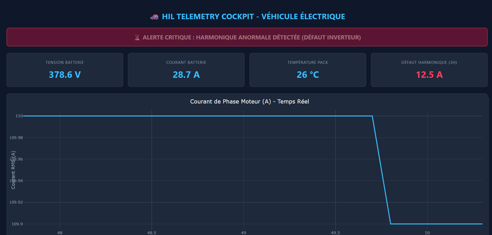

# 🚗 Real-Time EV Powertrain BMS Diagnostic & DSP Signal Monitoring (SIL / SocketCAN)


## 📌 Overview
An end-to-end **Software-in-the-Loop (SIL)** diagnostic and telemetry platform for Electric Vehicle (EV) powertrains and Battery Management Systems (BMS). 

The platform simulates multi-node CAN bus telemetry, performs real-time state estimation (**Extended Kalman Filter - EKF**) for battery SoC/SoH, executes **DSP spectral analysis** (FFT/Harmonic tracking) for inverter fault detection, and displays live telemetry on an industrial dark-mode cockpit dashboard.

---

## 🏗️ System Architecture

```text
  +-------------------------------------------------------+
  |              EV Powertrain Simulator                  |
  |      (Python + SciPy + cantools + SocketCAN vcan0)      |
  +---------------------------+---------------------------+
                              |
                              | CAN Frames (0x100 Battery / 0x200 Motor)
                              v
  +---------------------------+---------------------------+
  |               C++17 ECU Diagnostic Engine             |
  |  - Extended Kalman Filter (EKF) SoC Estimation        |
  |  - Signal Processing (Harmonic Fault Detector)        |
  +---------------------------+---------------------------+
                              |
                              v
  +-------------------------------------------------------+
  |           HIL Telemetry Cockpit Dashboard             |
  |      (FastAPI + Plotly / Live Web Telemetry Engine)   |
  +-------------------------------------------------------+


